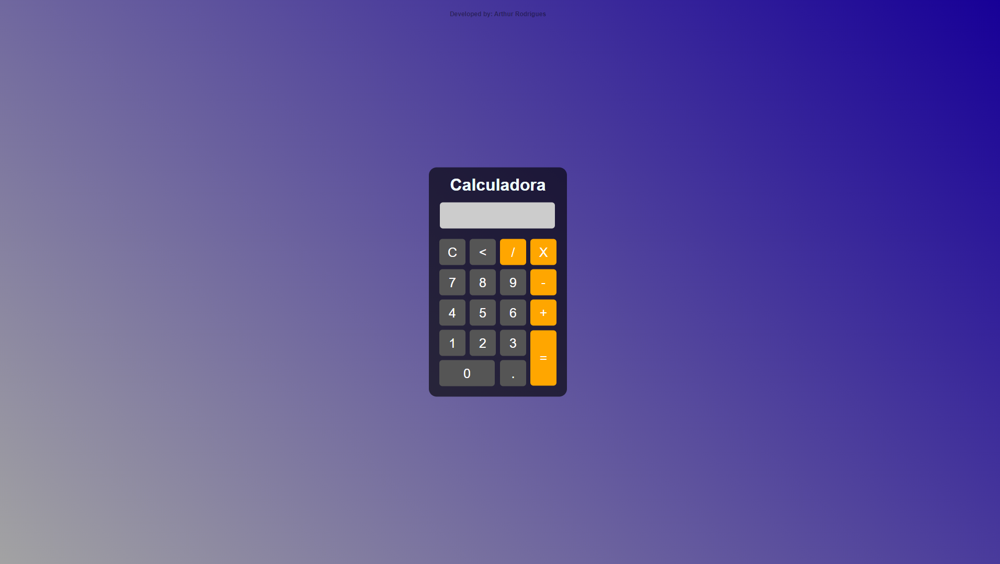

<h1 align="center"> CloudCalcWeb </h1>

Bem-vindo ao projeto da Calculadora Web, uma aplicação simples e eficiente desenvolvida com HTML, CSS e JavaScript. Esta calculadora foi projetada para fornecer uma experiência de usuário intuitiva e funcional, permitindo realizar cálculos matemáticos de maneira rápida e fácil diretamente no navegador.  

  <a href="#-tecnologias">Tecnologias</a>&nbsp;&nbsp;&nbsp;|&nbsp;&nbsp;&nbsp;
  <a href="#-projeto">Projeto</a>

 

  

## 🚀 Tecnologias

Esse projeto foi desenvolvido com as seguintes tecnologias:

- HTML: Estruturação da página web.
- CSS: Estilização para uma aparência moderna e atraente.
- JavaScript: Lógica de programação para a realização de cálculos e interatividade.
- Git: Controle de versão para o gerenciamento do código-fonte.
- GitHub: Plataforma de hospedagem de código-fonte e colaboração.

## 💻 Projeto

Apresentamos a Calculadora Web: a solução perfeita para cálculos rápidos e intuitivos, desenvolvida com HTML, CSS, JavaScript, Git e hospedada no GitHub. Uma ferramenta essencial para simplificar suas operações matemáticas, com uma interface amigável e responsiva. Calcule com facilidade, esteja você no desktop ou em movimento. A matemática nunca foi tão acessível!

- Interface Amigável: Uma interface limpa e amigável que torna a utilização da calculadora intuitiva para usuários de todos os níveis.
- Operações Básicas: Realize operações matemáticas fundamentais, como adição, subtração, multiplicação e divisão.

##

